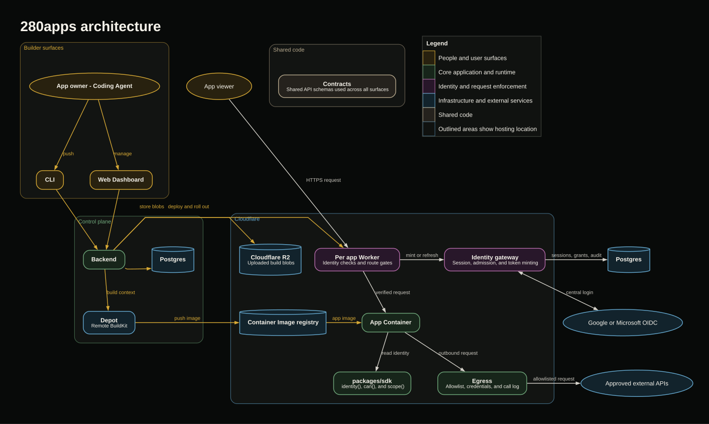

# 280apps

<p align="center">
  
</p>


Professionals across every single domain are aggresively using AI coding agents to vibe-code internal tools for their teams. However, they quickly run into issues:
* Auth and permissions get complicated fast (especially for those working in sensitive domains like finance and health)
* Agents write risky security code from scratch every time
* Non-technical teammates have no easy way to review, adjust, or manage access control

280apps.com is a platform built to solve these issues. It provides:
* A managed environment, backend by Cloudflare containers, to securely deploy your applicationm, store and use secrets, and integrate with your existing production data sources
* An agent-first CLI, conforming to the [axi.md](https://axi.md/) format (token efficiency & agent friendly outputs)
* Tools for deployoing, add OAuth, managing secrets, and adding permissions for you and your team
* Peace of mind for professionals to continue vibe-coding toosl without ever debugging deploys, configuring auth, or worrying about security

## Find out for yourself

Your agent can answer if the 280apps platform is right for you:

```
Fetch 280apps.com/setup.md and analyze if the platform is a good fit for my app.
```

Then, when you're ready, ask it to deploy:

```
Fetch 280apps.com/setup.md and push.
```

## Agent facing docs

* [setup.md](packages/backend/docs/setup.md) - Start here
* [platform-support.md](packages/backend/docs/platform-support.md) - Current platform support


## Project structure

| package | description | Link to docs |
| --- | --- | --- |
| `packages/cli` | The CLI (npm `two80`). Push a directory, it deploys. | [README](packages/cli/README.md) |
| `packages/backend` | Control plane: deploy, identity, storage, agent facing docs. | No README yet |
| `packages/contracts` | Shared types and adapters between CLI and backend. | No README yet |
| `packages/dashboard` | Web dashboard for managing apps, access, and configuration. | No README yet |
| `packages/egress` | Secure outbound requests, credential injection, and call logging. | No README yet |
| `packages/gateway` | Central identity authority and route enforcement for deployed apps. | [README](packages/gateway/README.md) |
| `packages/sdk` | App identity, capability checks, and scope resolution. | No README yet |


## License

280 is source-available under the [Functional Source License, Version 1.1, ALv2 Future License](LICENSE.md) (FSL-1.1-ALv2). You may read, audit, modify, and run the code for any permitted purpose, including running it for yourself or your team. Offering a competing hosted service is not permitted. Each release additionally becomes available under the Apache License 2.0 two years after it ships.

**Self-hosting vs. managed:** the source is open so you can audit exactly what runs and secures your apps. Running your own instance requires your own Cloudflare, Depot, and Postgres accounts and is currently unsupported. The managed service at [280apps.com](https://www.280apps.com) is the recommended path.

**Trademarks:** the "280" and "280apps" names and logo are trademarks of Kishore Adimulam and may not be used for forks or derived services without permission.

## Architecture

<p align="center">
  
</p>
