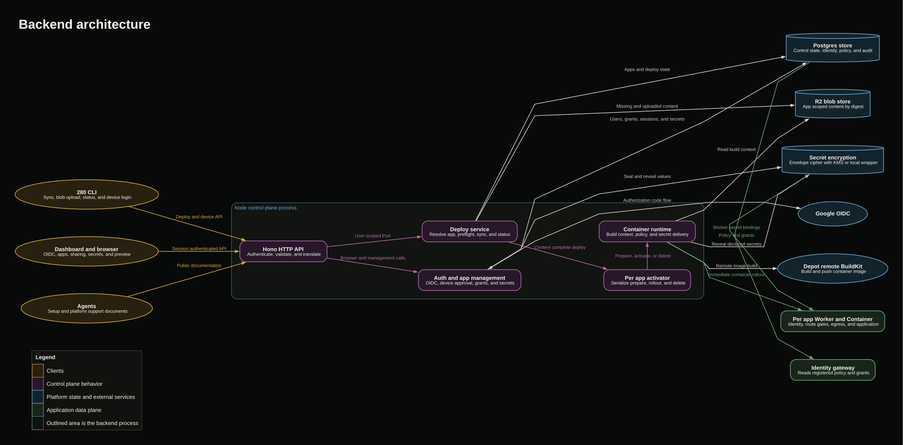

# @280/backend

The backend is the 280 control plane. It exposes the deploy and device login API used by the CLI, the browser session and app management API used by the dashboard, agent facing documentation, and the orchestration that turns an uploaded build context into a live Cloudflare Container application.

The production entrypoint is a Node process deployed on Railway. It assembles one Hono server, Postgres store, R2 compatible blob store, runtime, and in process activator for the lifetime of the process. Application request traffic does not pass through this service after deployment.

## Backend architecture diagram



The editable Graphviz source is in [`docs/backend-flow.dot`](docs/backend-flow.dot).

### Sample flow: application deployment

1. The CLI sends `POST /v1/sync` with an application identity and manifest.
2. The API authenticates the machine token, validates the request, and scopes the deploy service to that user.
3. The deploy service runs server side preflight before creating state, resolves or creates the application, derives a deterministic deploy identifier, and returns the missing content digests.
4. The CLI streams missing blobs with parallel `PUT` requests. The blob store verifies each body against its declared digest before persisting it.
5. The final required blob causes the deploy service to invoke the per application activator. There is no separate activation endpoint.
6. The runtime materializes the build context and asks Depot to build and push an image to the Cloudflare registry.
7. The runtime rolls the per application Worker and Container to the prepared image, applies route and egress policy, and delivers declared secrets.
8. Postgres atomically marks the deploy live, updates the serving deploy, registers the application policy, and preserves the stable application URL.
9. The CLI polls status until it receives the live URL or an agent actionable failure.

### Sample flow: deployment waits for secrets

1. A manifest declares one or more secret names.
2. The runtime builds the image without changing the serving version.
3. If any declared value is absent, the activator parks the deploy in `waiting_secrets` instead of rolling it live.
4. The dashboard encrypts a submitted value, stores its envelope in Postgres, and delivers the value to the per application Worker binding.
5. Once every declared value is configured, the backend resumes the same deploy and rolls the prepared image live.
6. A scheduled sweep fails deployments that remain waiting beyond the configured window with a direct dashboard link and recovery instruction.

### Sample flow: CLI device login

1. The CLI requests a device code without authentication.
2. The backend stores only a hash of the device secret and returns a human readable code plus the verification URL.
3. The user signs in through the configured OIDC provider and approves the code in the dashboard.
4. The CLI retries token redemption. Pending approval remains a typed `authorization_pending` result.
5. After approval, redemption atomically claims the code and returns a machine token. Only the token hash is persisted.
6. Subsequent deploy calls use that bearer token and are scoped to the resolved user.

### Sample flow: sharing and policy registration

1. The live manifest contributes access mode, feature roles, route gates, and declared secret names.
2. `finishLive` registers that policy and ensures the application owner has an owner grant.
3. The dashboard lists, adds, and revokes flat grants through session authenticated internal routes.
4. A dashboard general access override is stored separately from the manifest and remains effective across redeploys.
5. The identity gateway reads the registered policy and grants from the shared store when deciding whether to admit a viewer.
6. Grant, policy, preview, and application access changes are written to the audit event stream.

## Runtime boundaries

The control plane prepares and deploys applications, but it is not their data plane. Each live application is served by its own Cloudflare Worker in front of its own Container. Identity enforcement happens in the gateway and per application Worker. Outbound enforcement happens through `@280/egress` around the Container.

Production uses Postgres, R2 through its S3 API, Depot, Cloudflare registry images, and Cloudflare Containers. The filesystem blob store and memory runtime exist for local development and tests only.

### Components and implementation

| Component | Responsibility | Implementation |
| --- | --- | --- |
| Node composition root | Resolves configuration, opens process lifetime dependencies, starts HTTP, schedules cleanup, and performs graceful shutdown. | `src/main.ts` |
| HTTP API | Authenticates requests, validates wire bodies, maps typed errors to HTTP responses, and exposes deploy, auth, dashboard, secret, sharing, preview, docs, and health routes. | `src/api.ts` |
| Deploy service | Implements the user scoped deploy contract, application resolution, preflight, content synchronization, status, and confirmed deletion. | `src/deploysvc.ts` |
| Activator | Serializes activation and deletion per application, prepares builds, waits for secrets, rolls live, and records terminal state. | `src/activator.ts` |
| Runtime seam | Defines prepare, activate, and delete independently of the concrete hosting substrate. | `src/seams.ts` |
| Container runtime | Converts manifests and blobs into build and rollout jobs carrying access and egress policy. | `src/runtime/container/container.ts` |
| Depot builder | Opens remote Depot builds and pushes images directly to the Cloudflare registry without a local Docker daemon. | `src/runtime/container/depot-builder.ts` |
| Registry rollout | Materializes contexts, runs external commands safely, generates Worker configuration, rolls images, and tears applications down. | `src/runtime/container/registry-builder.ts` |
| Postgres store | Persists users, sessions, tokens, apps, deploys, policies, grants, secrets, previews, and audit events behind one store seam. | `src/store/store.ts` |
| Migrations | Provides one schema qualified, idempotent DDL sequence used at boot and by the standalone migration runner. | `src/store/migrations.ts`, `src/migrate.ts` |
| Blob stores | Provide digest scoped application content storage through filesystem and S3 compatible implementations. | `src/blobstore/` |
| Browser authentication | Runs OIDC login, stable user resolution, hashed opaque sessions, redirect validation, and login rate limiting. | `src/authsvc.ts`, `src/auth/oidc.ts` |
| Secret storage and delivery | Encrypts values into envelopes and synchronizes live declarations to Worker secret bindings. | `src/secrets.ts`, `src/kms.ts`, `src/secret-delivery.ts` |
| Sharing surface | Renders the share dialog and manages grants, access overrides, and preview grants through the API and store. | `src/sharepage.ts`, `src/api.ts`, `src/store/store.ts` |
| Agent documentation | Serves setup, platform support, and capability documents at stable unauthenticated endpoints. | `src/docs.ts`, `src/docs/` |
| Observability | Adds request observations, account context, structured logging, and panic rendering around every route. | `src/observe.ts`, `src/logger.ts` |
| Dependency selection | Selects runtime, builder, auth provider, secret delivery, and scheduled cleanup behavior. | `src/deps.ts` |

## State and failure model

1. Manifest preflight completes before state changes.
2. Deploy identifiers derive from application identity and canonical manifest content, so repeating sync resumes the same deploy.
3. Blobs are content addressed, application scoped, order independent, and safe to upload again.
4. The last missing blob is the activation trigger. Repeating sync repairs interruption between upload and activation.
5. Activation and deletion are serialized per application.
6. A serving version changes only after build and rollout succeed.
7. Nonretryable failures include a concrete agent fix. Transient platform faults are marked retryable.
8. Secret values are encrypted at rest and are never stored in manifests or blob content.

## Configuration and migrations

Runtime configuration is resolved in `src/config.ts`. Variable names and expected shapes are documented in the repository `.env.example`; this README intentionally does not duplicate environment values.

The Node service applies idempotent migrations during startup. CI can run the same migration source explicitly:

```sh
pnpm --filter @280/backend build
pnpm --filter @280/backend migrate
```

Migrations are not exposed over HTTP.

## Development

Run these commands from this package directory:

```sh
pnpm build
pnpm typecheck
pnpm test
```

Behavioral, transport, persistence, runtime, authentication, permissions, secret, and migration coverage lives in `test/`.
