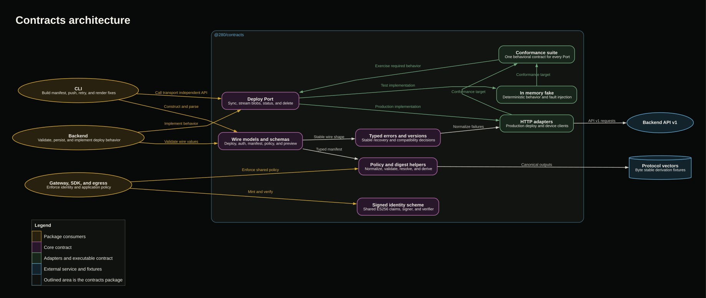

# @280/contracts

The contracts package is the shared protocol and policy boundary between the 280 CLI, backend, gateway, and SDK. It owns deploy and device login wire models, runtime schemas, stable error codes, content derivations, access policy helpers, and the signed application identity format.

It also provides the deploy `Port`, a production HTTP adapter, an in memory fake, and one executable conformance suite. Consumers depend on the same behavior instead of maintaining local interpretations of the protocol.

## Contracts architecture diagram



The editable Graphviz source is in [`docs/contracts-flow.dot`](docs/contracts-flow.dot).

### Sample flow: one deploy contract across transports

1. The CLI builds a `SyncRequest` and calls the transport independent deploy `Port`.
2. In production, the HTTP adapter sends the request to the backend and parses the response with the shared schema.
3. In unit tests, the in memory fake implements the same `Port` without network or platform infrastructure.
4. The caller uploads only missing content digests, then polls the same status method until the deploy is terminal.
5. Both adapters throw `DeployErr` with the same codes, retry semantics, and agent facing fix fields.
6. The shared conformance cases run the protocol sequence against each implementation to detect behavioral drift.

### Sample flow: deterministic synchronization

1. `digestBytes` computes the content address of each build context blob.
2. `canonicalDigest` folds build configuration, files, access policy, routes, config, and compatibility fields into one deterministic manifest digest.
3. The backend combines the application identifier and canonical digest to derive the deploy identifier.
4. Repeating sync for unchanged content therefore resumes the same deployment instead of creating another attempt.
5. A policy or content change alters the digest and produces a distinct deploy.

### Sample flow: policy declared once and enforced in multiple places

1. The CLI parses `280.json` into shared manifest types and calls the shared policy validators.
2. The backend validates the normalized wire manifest again before changing state.
3. Access helpers resolve route gates and role ordering for the gateway and application Worker.
4. The legacy egress shape remains parseable for wire compatibility, while deploy preflight rejects any non-empty app policy.
5. The canonical manifest digest includes policy, so a policy change cannot be separated from the deployment that enforces it.

### Sample flow: signed application identity

1. The gateway creates `IdentityClaims` containing the viewer, application audience, app role, feature role, capabilities, scope, and lifetime.
2. `IdentitySigner` signs the compact token with ES256 and the gateway private key.
3. The application Worker or SDK constructs `IdentityVerifier` from public JWKs.
4. Verification checks token type, algorithm, key identifier, signature, issuer, audience, and time bounds.
5. The application receives a normalized `VerifiedIdentity` only after every check succeeds.

### Sample flow: device authentication

1. The auth HTTP client requests a device code from the unauthenticated backend endpoint.
2. The backend response is parsed with `deviceCodeResponseSchema`.
3. Token redemption returns a machine token after approval or throws the shared `authorization_pending` error while waiting.
4. Transport and malformed response failures become retryable typed errors, so the CLI renders one consistent recovery shape.

## Compatibility principles

1. Wire schemas preserve unknown fields so a newer peer does not break an older one.
2. Absent or null optional fields fold to documented zero values where protocol compatibility requires it.
3. Content and policy derivations use deterministic byte ordering.
4. Every nonretryable deploy error carries an actionable fix. Retryable errors tell the caller to repeat the same idempotent sequence.
5. Blob uploads stream through the `Port`; large bodies are not buffered by the HTTP adapter.
6. Identity verification fails closed on malformed or mismatched cryptographic claims.

### Components and implementation

| Component | Responsibility | Implementation |
| --- | --- | --- |
| Deploy and auth models | Defines manifests, applications, deploy state, sync, status, delete, device flow, access, route, preview, and policy shapes with Zod schemas. | `src/types.ts` |
| Deploy port | Defines the idempotent sync, blob upload, status, and delete interface used by callers and adapters. | `src/port.ts` |
| Error contract | Defines stable deploy and auth codes, their HTTP mapping, the wire error schema, and throwable `DeployErr`. | `src/errors.ts`, `src/deploy/error.ts` |
| HTTP deploy adapter | Implements `Port` over API v1, streams blob bodies, attaches machine and CLI version headers, validates responses, and normalizes transport failures. | `src/deploy/http.ts` |
| Device auth adapter | Starts and redeems the device flow while preserving the shared typed error model. | `src/auth/http.ts` |
| In memory fake | Implements the deploy contract with deterministic application and deploy identity plus controllable transport and activation failures. | `src/deploy/fake.ts` |
| Conformance suite | Runs the same end to end behavioral cases against any fresh `Port` implementation. | `src/deploy/conformance.ts` |
| Content derivations | Computes blob digests, canonical manifest digests, and the manifest blob set. | `src/types.ts` |
| Access policy helpers | Normalizes access modes, compares app roles, resolves route gates, checks effective grants, and derives registered app policy. | `src/types.ts` |
| Legacy egress compatibility | Parses the retired wire shape so old clients receive an actionable preflight rejection. | `src/types.ts` |
| Signed identity | Defines claims and performs ES256 signing, public JWK projection, and fail closed verification. | `src/identity.ts` |
| Version comparison | Compares CLI release versions consistently on client and server. | `src/version.ts` |
| HTTP body helpers | Safely reads error bodies and extracts messages for transport adapters. | `src/http-body.ts` |
| Public exports | Provides the root protocol surface and explicit adapter subpaths. | `src/index.ts`, `package.json` |

## Public entrypoints

| Import | Purpose |
| --- | --- |
| `@280/contracts` | Core types, schemas, errors, policy helpers, identity helpers, deploy port, and version utilities. |
| `@280/contracts/deploy/http` | Production deploy HTTP client. |
| `@280/contracts/deploy/fake` | In memory deploy fake with fault injection. |
| `@280/contracts/deploy/conformance` | Reusable behavioral contract cases. |
| `@280/contracts/auth/http` | Device authentication HTTP client. |
| `@280/contracts/identity` | Signed identity claims, signer, verifier, and constants. |

## Conformance

Repository test suites run the shared cases against the in memory fake and the backend deploy service. Cross implementation conformance can target a running server by setting `TWO80_CONFORMANCE_URL`; each case receives a fresh logical account.

Protocol vectors in `testdata/` cover deterministic derivations that must remain byte compatible across implementations.

## Development

Run these commands from this package directory:

```sh
pnpm build
pnpm typecheck
pnpm test
```

Schema, transport, fake, policy, identity, vector, and conformance coverage lives in `test/`.
