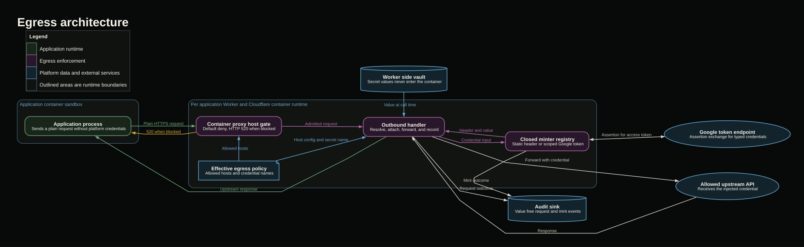

# @280/egress

The egress package is the outbound security layer for deployed applications. It applies each application's host allowlist to its Cloudflare Container, intercepts permitted requests in the surrounding Worker, attaches vault held credentials in flight, and emits value free audit events. The platform never places a secret value or minted access token in the container's request, environment, image, or policy parameters.

Outbound internet is denied by default. The actual host gate is enforced by `@cloudflare/containers`; this package owns policy wiring, credential injection, typed credential minting, and audit logging.

## Egress architecture diagram



The editable Graphviz source is in [`docs/egress-flow.dot`](docs/egress-flow.dot).

### Sample flow: static API credential

1. The application container sends a plain HTTPS request to a host declared in its egress policy.
2. The Cloudflare container proxy admits the host and routes the request to the named egress handler.
3. The handler resolves the declared secret name against the Worker side vault.
4. The header minter formats the credential using the configured header and scheme.
5. The handler creates a new upstream request containing the credential. The container's original request remains unchanged.
6. The upstream response is returned to the container.
7. The handler emits a request audit event containing the secret name and whether a credential was attached, but never its value. Query strings are omitted from the logged path.

### Sample flow: Google service account credential

1. The application container sends a plain request to an allowed Google API host.
2. The handler reads the service account JSON from the Worker side vault and passes it to the closed minter registry.
3. The Google service account minter signs an assertion and exchanges it at Google's token endpoint.
4. The minter caches the access token by application, secret name, normalized scopes, and secret value digest. Concurrent requests share one mint operation.
5. The handler attaches the access token only to the request sent to the Google API.
6. Safe mint and request audit events are emitted without the assertion, private key, provider response, or access token.
7. A downstream 401 evicts the cached token so the next request mints again.

### Sample flow: allowed host without a credential

1. The container requests a host present in `allowedHosts` with no matching credential entry.
2. The container proxy routes the request through the egress handler.
3. The handler forwards the request without adding an authorization header.
4. A request audit event records that no credential was attached.

### Sample flow: request is denied

1. If the destination is absent from the allowlist, the Cloudflare container proxy returns HTTP 520 before the egress handler or upstream is reached.
2. If a credential is configured but its secret is missing from the vault, the handler returns HTTP 520 and does not forward an unauthenticated request.
3. If the credential type is unknown or minting fails, the handler returns HTTP 520 with a fixed, value free failure category.

## Policy example

Application authors declare policy in `280.json`. Credential hosts are normalized into the effective allowlist during bundling.

```json
{
  "secrets": ["STRIPE_KEY", "SHEETS_SERVICE_ACCOUNT"],
  "egress": {
    "allow": ["data.example.com"],
    "credentials": [
      {
        "host": "api.stripe.com",
        "secret": "STRIPE_KEY",
        "header": "authorization",
        "scheme": "Bearer"
      },
      {
        "host": "sheets.googleapis.com",
        "secret": "SHEETS_SERVICE_ACCOUNT",
        "type": "google-service-account",
        "scopes": ["https://www.googleapis.com/auth/spreadsheets.readonly"]
      }
    ]
  }
}
```

The manifest contains secret names and credential configuration only. Secret values remain in Worker bindings and are resolved at request time.

### Components and implementation

| Component | Responsibility | Implementation |
| --- | --- | --- |
| Application container | Runs untrusted application code and originates requests without platform credentials. Internet access is disabled by default and HTTPS interception is enabled by the platform harness. | `platform/appcontainer/src/container.js` |
| Policy application | Normalizes allowed hosts, configures the container gate, and binds every admitted host to the named handler with serializable parameters. | `src/register.ts` |
| Cloudflare container proxy | Enforces the fail closed host allowlist and invokes the registered outbound handler for admitted destinations. | `@cloudflare/containers` |
| Outbound handler | Resolves policy parameters, obtains credentials, dispatches to a minter, attaches the resulting header, forwards the request, and records the outcome. | `src/handler.ts` |
| Vault | Resolves a secret value by name from the Worker environment. Test and local callers can substitute an in memory vault. | `src/vault.ts` |
| Header minter | Formats a static vault value under the declared header and scheme. | `src/minters.ts` |
| Google service account minter | Mints scoped Google access tokens, provides single flight caching and early refresh, and evicts on downstream 401 responses. | `src/minters.ts` |
| Request audit | Records destination, method, path, status, outcome, secret name, and credential attachment without recording values or query strings. | `src/calllog.ts` |
| Mint audit | Records typed credential mint, cache, and fixed category failure outcomes without sensitive token material. | `src/calllog.ts` |
| Structural container types | Defines only the Cloudflare container surface needed by this package, avoiding a runtime dependency on the container library. | `src/types.ts` |
| Public package surface | Exposes registration, policy application, handler construction, vaults, minters, audit types, and integration types. | `src/index.ts` |
| Production integration | Registers the handler once and applies the application policy immediately before an authorized request is sent to the container. | `platform/appcontainer/src/worker.js` |

## Security invariants

1. An absent or malformed policy becomes an empty allowlist.
2. A destination outside the allowlist never reaches the outbound handler or upstream.
3. A configured credential with no vault value never falls through to an unauthenticated request.
4. Secret values cross neither the container boundary nor the serialized handler parameter boundary.
5. Typed credentials dispatch through a closed registry. Unknown types fail closed.
6. Logs include secret names and fixed failure categories only. They omit secret values, tokens, assertions, provider response bodies, and URL query strings.

Upstream response content is outside this boundary. An external provider can echo sensitive content in its response, which application code can then observe.

The end to end exfiltration regression guard is `test/exfil.test.ts`.

## Development

Run these commands from this package directory:

```sh
pnpm build
pnpm typecheck
pnpm test
```

Behavioral, minting, and security coverage lives in `test/`.
