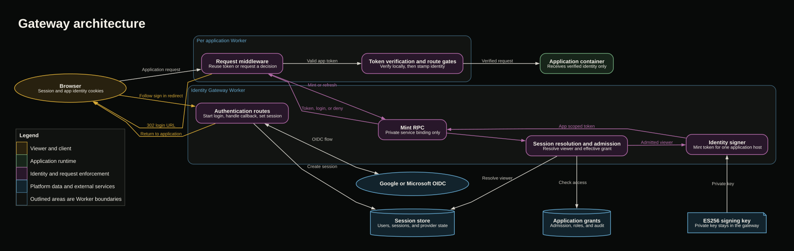

# @280/gateway

The gateway is a Cloudflare Worker that serves as the central identity authority for deployed applications. It handles authentication requests and mints signed, app scoped identity tokens through a Cloudflare service binding. Application Workers verify those tokens and enforce access locally before forwarding requests to their containers.

The gateway does not proxy application traffic.

## Gateway architecture diagram



The editable Graphviz source is in [`docs/gateway-flow.dot`](docs/gateway-flow.dot).

### Sample flow: viewer signs in to a protected application

1. The browser requests a protected application without a usable identity token or session.
2. The Application Worker asks the Mint RPC for a decision and receives a login destination.
3. The Application Worker returns a 302 response containing that destination.
4. The browser follows the redirect to the gateway authentication routes and completes the configured identity provider flow.
5. The gateway establishes the session and returns the browser to the original application.
6. The Application Worker asks the Mint RPC again, now with the session.
7. The gateway resolves the viewer, checks application access, and signs an app scoped identity token.
8. The Application Worker verifies the new token locally, applies route gates, stores the token for subsequent requests, and forwards the request to the container.

### Sample flow: returning admitted viewer

1. The browser sends a request with an existing app scoped identity token.
2. The Application Worker verifies the signature, issuer, audience, and lifetime using cached public keys.
3. The Worker evaluates the requested path against the roles in the verified token.
4. The Worker removes any untrusted inbound identity headers, stamps the verified identity, and forwards the request to the container.
5. No gateway or database call is needed while the local token remains valid.

### Sample flow: signed in viewer is denied

1. The browser reaches a protected application with a valid session but no usable app scoped token.
2. The Application Worker requests a mint decision from the gateway.
3. The gateway resolves the viewer but finds no matching application grant.
4. The Mint RPC returns a denial without signing a token.
5. The Application Worker returns a forbidden response and does not contact the application container.

### Components and implementation

| Component | Responsibility | Implementation |
| --- | --- | --- |
| Browser | Sends application requests, follows sign in redirects, and stores the session and app scoped identity cookies. | External client |
| Application Worker | Owns the application host, coordinates token renewal, and forms the security boundary in front of the container. | `src/appworker.ts` |
| Request middleware | Reuses a valid local identity token when possible. If no usable token exists, it requests a new decision from the gateway. | `src/appworker.ts` |
| Authentication routes | Start the identity provider flow, process the callback, establish the viewer session, and return the viewer to the application. | `src/gateway.ts`, `src/pages.ts`, `src/cookies.ts` |
| Mint RPC | Provides the private service binding surface used by Application Workers. It returns a token, a login destination, or a denial. | `src/worker.ts`, `src/mint.ts` |
| Session resolution and admission | Resolves the viewer from the session and checks whether that viewer may open the requested application. | `src/gateway.ts`, `src/access.ts` |
| Session store | Persists users, authentication sessions, and provider state. Application Workers do not access it directly. | Assembled in `src/deps.ts` |
| Application grants | Describe who may enter an application and which roles apply to an admitted viewer. | `src/access.ts` |
| Identity signer | Creates a short lived token whose audience is the requested application host. The private key remains inside the gateway. | `src/identity.ts` |
| Token verification and route gates | Verifies the signature and claims locally, then checks the requested path against the viewer roles. | `src/identity.ts`, `src/appworker.ts`, `src/routegate.ts` |
| Application container | Receives only requests that passed token verification and route policy enforcement. | Called from `src/appworker.ts` |
| Runtime configuration | Defines bindings, secrets, defaults, environment parsing, and deployment settings without duplicating environment values in this document. | `src/config.ts`, `wrangler.jsonc`, `wrangler.development.jsonc`, `scripts/gen-signing-key.mjs` |
| Runtime assembly | Connects providers, persistence, authorization, signing, and request scoped dependencies. | `src/deps.ts` |
| Public package surface | Exposes the gateway library modules consumed by tests and other packages. | `src/index.ts` |

## Development

Run these commands from this package directory:

```sh
pnpm build
pnpm typecheck
pnpm test
```

Behavioral and security coverage lives in `test/`.
